# Procesverslag
Markdown is een simpele manier om HTML te schrijven.  
Markdown cheat cheet: [Hulp bij het schrijven van Markdown](https://github.com/adam-p/markdown-here/wiki/Markdown-Cheatsheet).

Nb. De standaardstructuur en de spartaanse opmaak van de README.md zijn helemaal prima. Het gaat om de inhoud van je procesverslag. Besteedt de tijd voor pracht en praal aan je website.

Nb. Door *open* toe te voegen aan een *details* element kun je deze standaard open zetten. Fijn om dat steeds voor de relevante stuk(ken) te doen.

## Jij

  
uitwerken voor kick-off werkgroep

  ### Auteur:
  Ravi Poots

  #### Je startniveau:
  Blauw ik ben heel erg onervaren

  #### Je focus:
Ik ga me focussen op het responsive maken van mijn website
 

## Je website

  
uitwerken voor kick-off werkgroep

  ### Je opdracht:
  link naar de website die je gaat namaken óf de naam/omschrijving van je eigen ontwerp
  https://www.burgerking.nl/ de website van de burgerking lijkt me erg interesant om na te maken.

  #### Screenshot(s) van de eerste pagina (small screen): 
  Home pagina van de burgerking
  

  #### Screenshot(s) van de tweede pagina (small screen):
 Menu pagina van de burgerking
  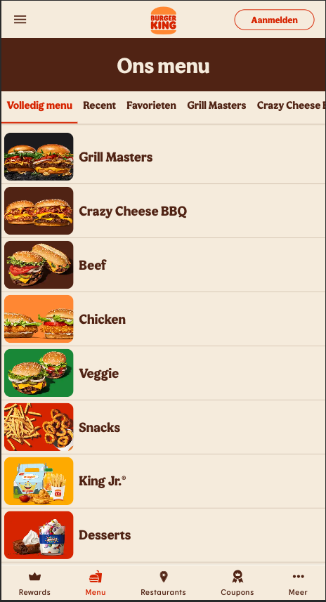 
 

## Toegankelijkheidstest 1/2 (week 1)

  
uitwerken na test in 2e werkgroep

  ### Bevindingen
  Lijst met je bevindingen die in de test naar voren kwamen:

  - Ik heb nog niet alle links goed beschreven
  - De site is nog niet responsive
  - Tussen sommige elementen zitten er nog niet genoeg ruimte
  - Ik heb niet overal de juiste header elementen gebruikt
  - Ik heb sommige heading levels overgeslagen
  - Ik heb nog geen goeie alt tekst gebruikt
  - Ik gebruik geen grafieken en kaarten om foto's te beschrijven
  - Darkmode wordt niet gesupport

  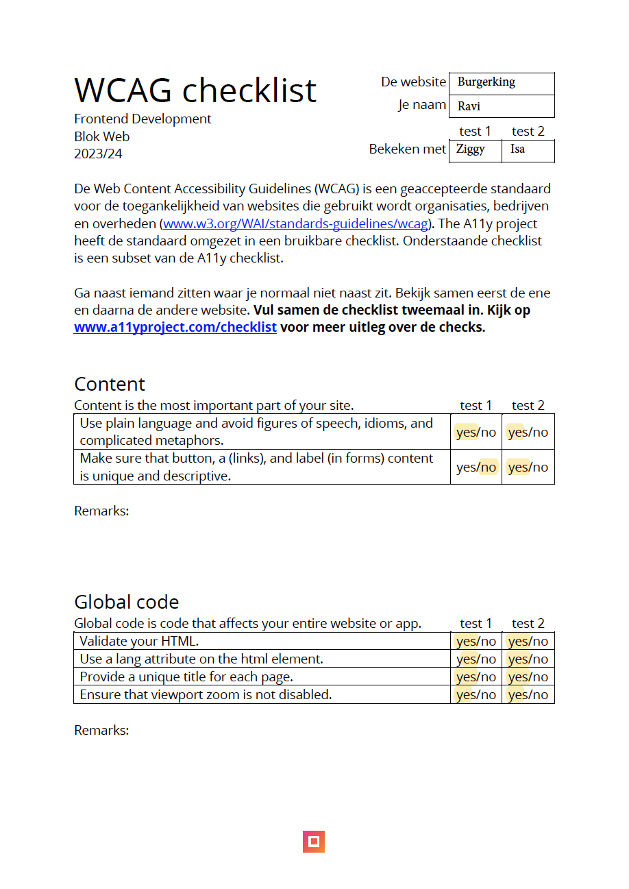
    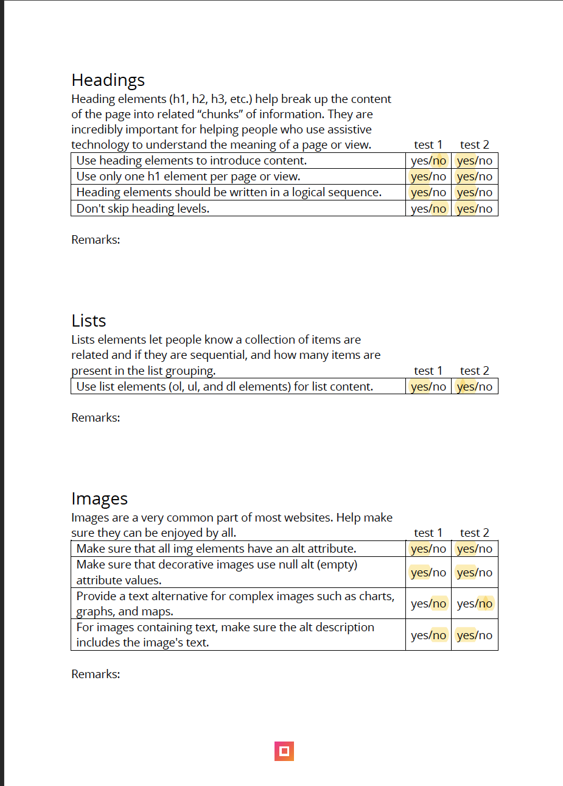
     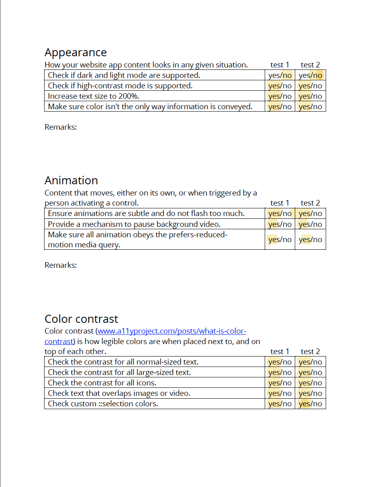
      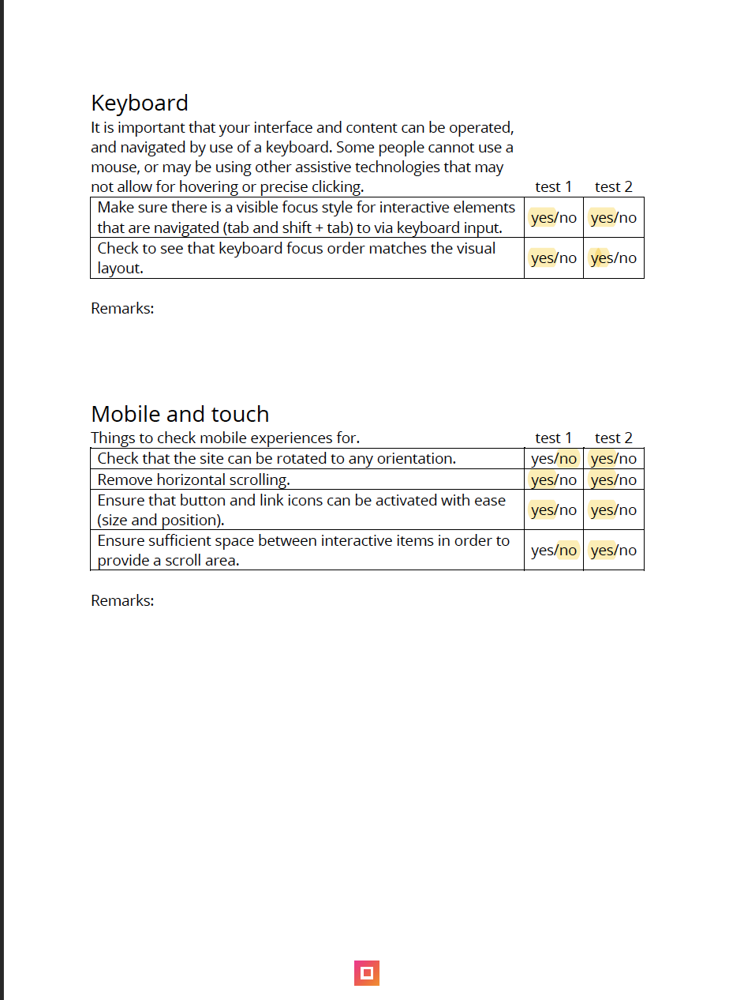
       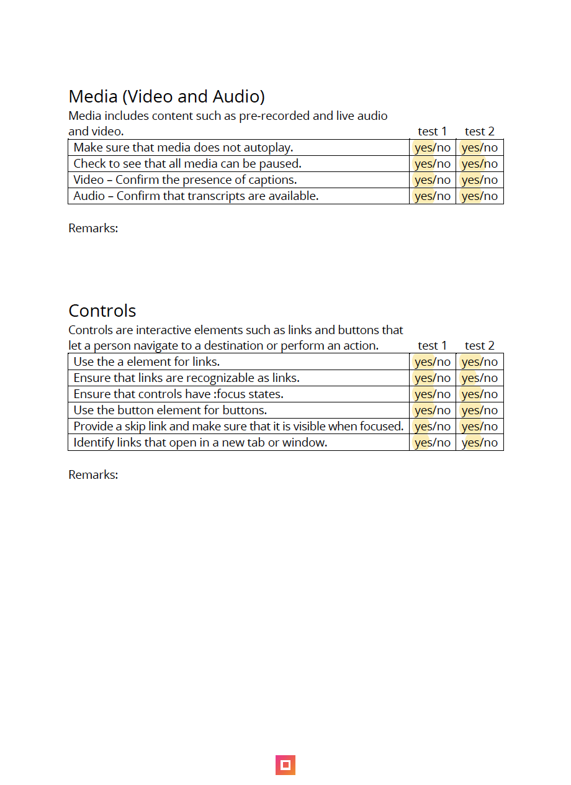

## Breakdownschets (week 1)

  
uitwerken na afloop 3e werkgroep

  ### Breakdown home pagina: 
  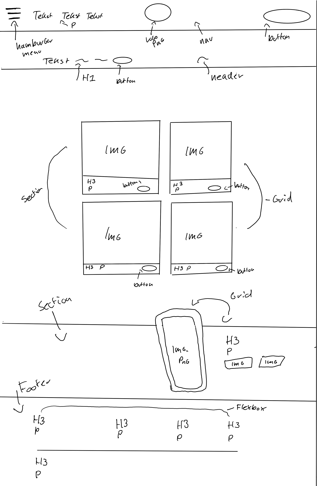

  ### Breakdown menu pagina: 
  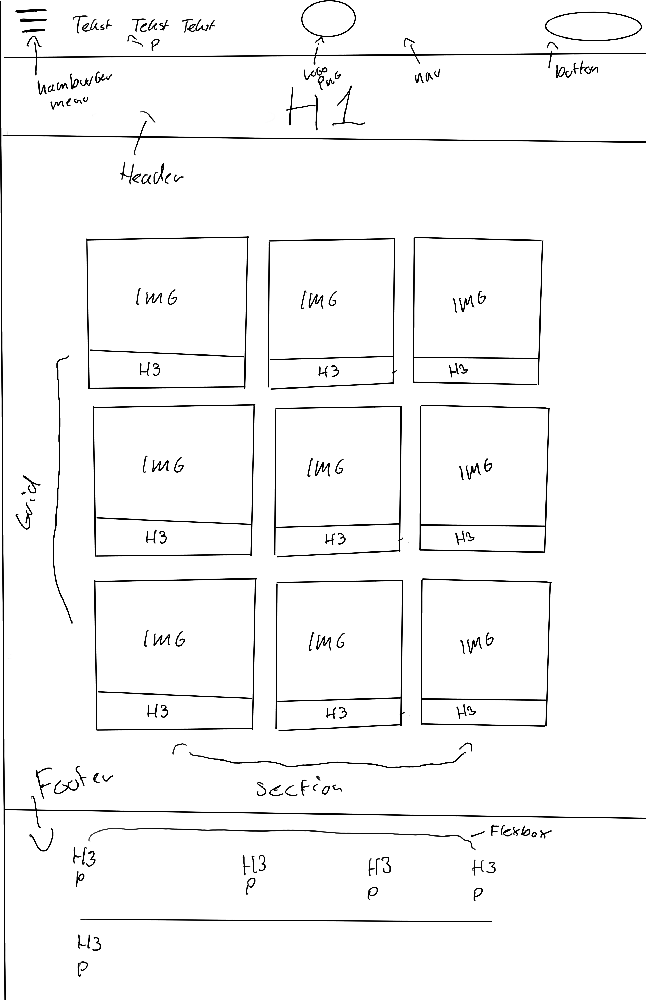

  ### Breakdown hamburger menu: 
  

## Voortgang 1 (week 2)

  
uitwerken voor 1e voortgang

  ### Stand van zaken
  hier dit ging goed & dit was lastig (neem ook screenshots op van delen van je website en code)

  het vormgeven van het telefoon formaat komt op start ik moet weer erg wennen aan het coderen. Ik ben nu bezig met het leren van grid en flexbox doormiddel van code pen. ik heb ook al gebruik gemaakt van mijn eerste media queries. Ik snap nu beter hoe het werkt en ga hier verder mee aan de slag. Ik ben begonnen aan het plaatsen van de content in mijn html voor mijn eerte pagina. Ik probeer mijn NAV te maken door middel van flexbox en hij staat nu wel mooi op webformaat maar niet op telefoon formaat dus daar moet ik nog iets aan gaan doen

 
 

  ### Agenda voor meeting
  samen met je groepje opstellen

  | student 1      | student 2          | student 3    | student 4        |
  | ---            | ---                | ---          | ---              |
  | dit bespreken  | en dit             | en ik dit    | en dan ik dat    |
  | en dat ook nog | dit als er tijd is | nog een punt | dit wil ik zeker |
  | ...            | ...                | ...          | ...              |

  ### Verslag van meeting
  hier na afloop snel de uitkomsten van de meeting vastleggen

  - punt 1 Ik ben nog niet heel ver
  - punt 2 De nav zit wel goed in elkaar
  - punt 3 Wat ik tot nu toe heb gedaan ziet er goed uit

## Voortgang 2 (week 3)

  
uitwerken voor 2e voortgang

  ### Stand van zaken
  hier dit ging goed & dit was lastig (neem ook screenshots op van delen van je website en code)
  eerst en tweede pagina is zijn kwa html helemaal af en voor de css ben ik bezig met het responsive maken en alles goed na maken. Mijn eerste pagina is al deels responisve omdat ik mijn eerste grid heb gemaakt. Ik snap nu ook beter hoe ik met media queries kan werken en hoe ik die kan toepassen op de rest van de pagina. Ik heb ook mijn 2de NAV gemaakt in de FOOTER dit is een NAV bar die op telefoon vormaat navigeert als de media querie onder de 1000px. Ik heb ook mijn hele nav bar veranderd die boven aan stond, eerst had ik hem gemaakt buiten mijn header en flexbox gebruikt. Nu heb ik grid gebruikt en hem in mijn header gezet, zodat hij goed responsive is. Ook heb ik een werkend hamburger menu gemaakt met hulp van de studenten assistent. 

  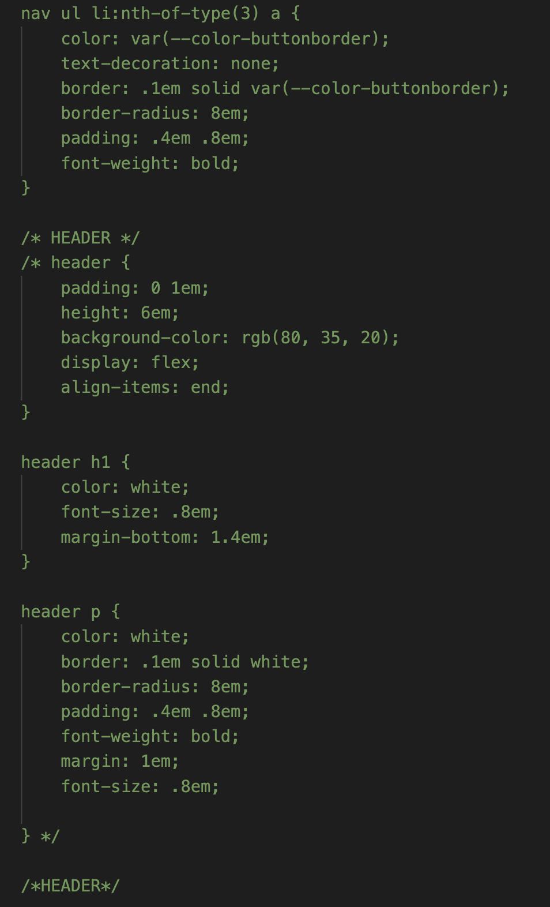
  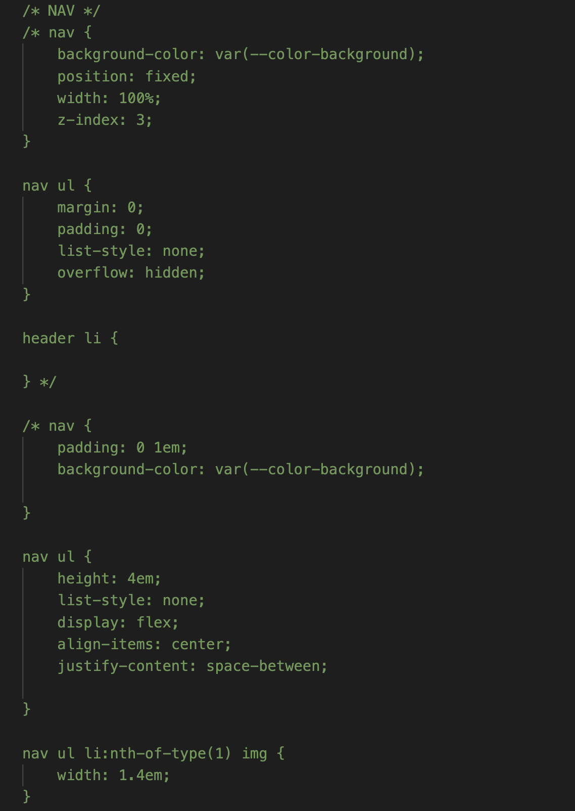

  De eerste twee foto's waren foto's van hoe mijn NAV eerst in me kaar zat en de twee foto's hier onder zijn foto's van hoe mijn nieuwe NAV er uit ziet.
  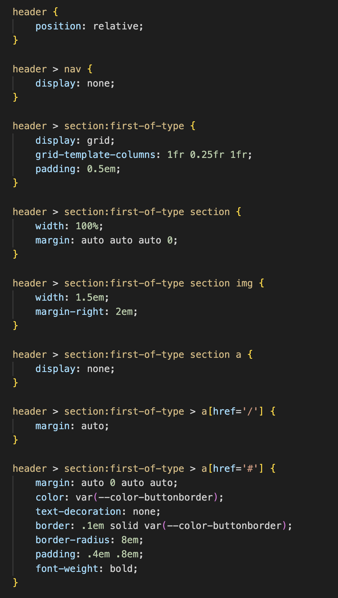
  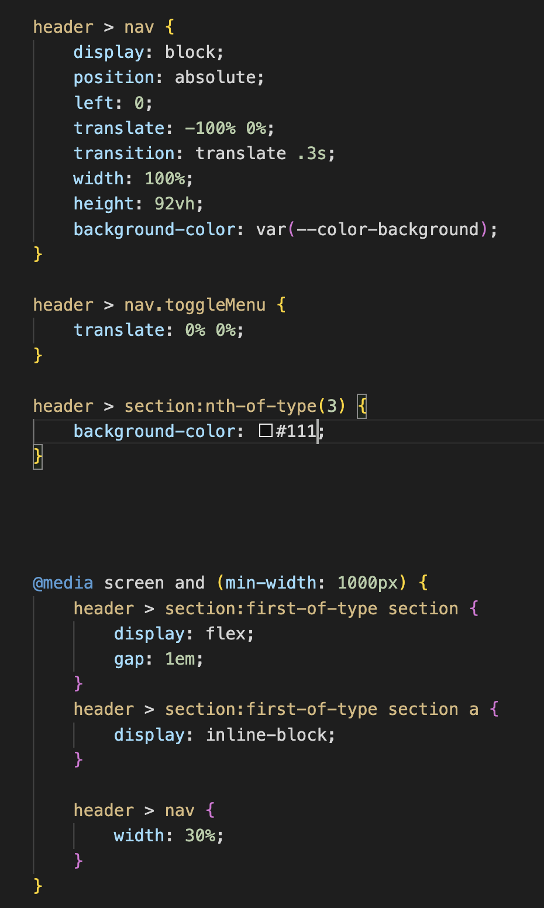

img

  ### Agenda voor meeting
  samen met je groepje opstellen

  | student 1      | student 2          | student 3    | student 4        |
  | ---            | ---                | ---          | ---              |
  | dit bespreken  | en dit             | en ik dit    | en dan ik dat    |
  | en dat ook nog | dit als er tijd is | nog een punt | dit wil ik zeker |
  | ...            | ...                | ...          | ...              |

  ### Verslag van meeting
  hier na afloop snel de uitkomsten van de meeting vastleggen

  - punt 1 De html ziet er goed uit
  - punt 2 Het responsive maken van de paginas gaat ook steeds beter
  - punt 3 NAV in de footer is gefixt met hulp van studenten assistenten.
  - punt 4 Nieuwe NAV gemaakt met hamburger menu.
  - punt 5 Steeds beter in het gebruiken van grid
- ...

## Toegankelijkheidstest 2/2 (week 4)

  
uitwerken na test in 9e werkgroep

   
    
     
      
       

  ### Bevindingen
  Lijst met je bevindingen die in de test naar voren kwamen (geef ook aan wat er verbeterd is):

  Dingen die ik heb veranderd na de laatste check

  - Ik heb links duidelijker beschreven
  - Ik heb meer margin gegeven tussen sommige objecten zodat het beter en overzichtelijker is.
  - Ik heb bij elke section een H2 gebruikt
  - Ik heb de headings die ik heb overgeslagen toegevoegd
  - Ik heb geen grafieken en charts gebruikt om moeilijke foto's toe te lichten
  - Ik heb de alt tekst bij foto's verbeterd en veranderd
  - Dark mode is niet supported

## Voortgang 3 (week 4)

  
uitwerken voor 3e voortgang

  ### Stand van zaken
  Mijn eerste pagina is nu bijna helemaal af er zijn verschillende grid structuren en hij loopt al best wel responsive. Ook heb ik een mockup van een telefoon waar de burgerking app in word gepromoot gemaakt. Deze staat in een section waar een gradient in staat waardoor het lijkt alsof hij uitsteekt. Verder ben ik nu bezig met het maken van mijn footer die op de pagina komt als de media querie groter dan 1200px wordt. Als dat klaar is is mijn website zo goed als af. Mijn tweede pagina is ook helemaal af en bijna helemaal responsive, ik gebruik nu de kennis die ik heb opgedaan over grid op deze pagina en dat werkt top. Ik heb ook een slider voor woorden gemaakt, zodat de gebruiker kan scrollen door de woorden.

  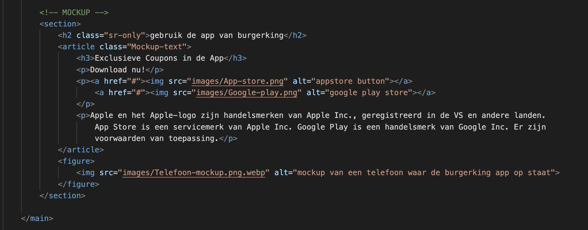
  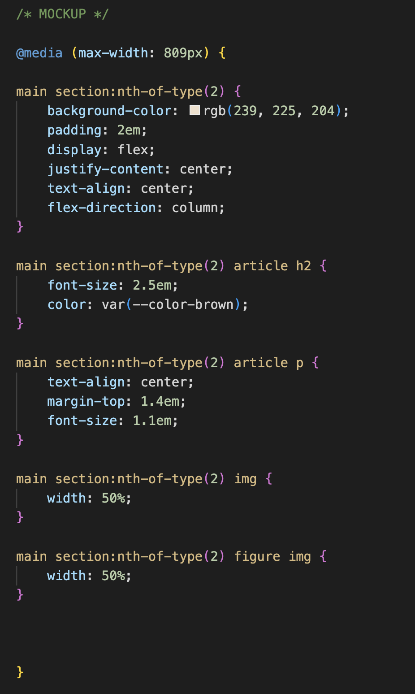
  

  Dit is de code die ik heb gebruikt om mijn mockup section te maken en om hem responsive te maken want er gebeurt best wel wat als die groter of kleiner wordt.

   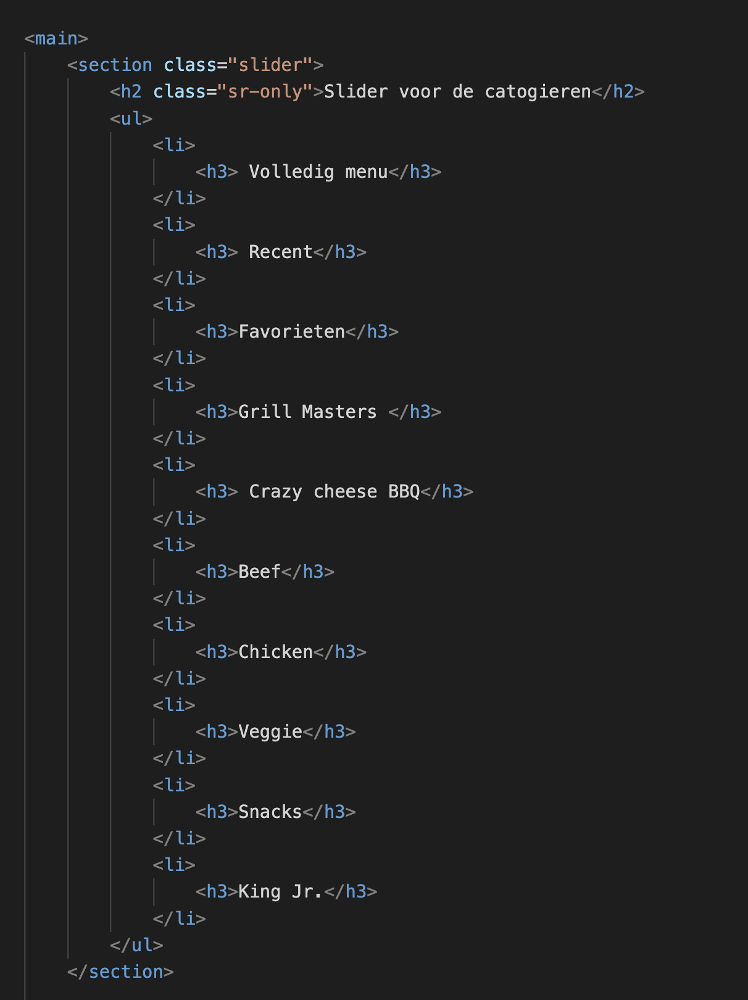
    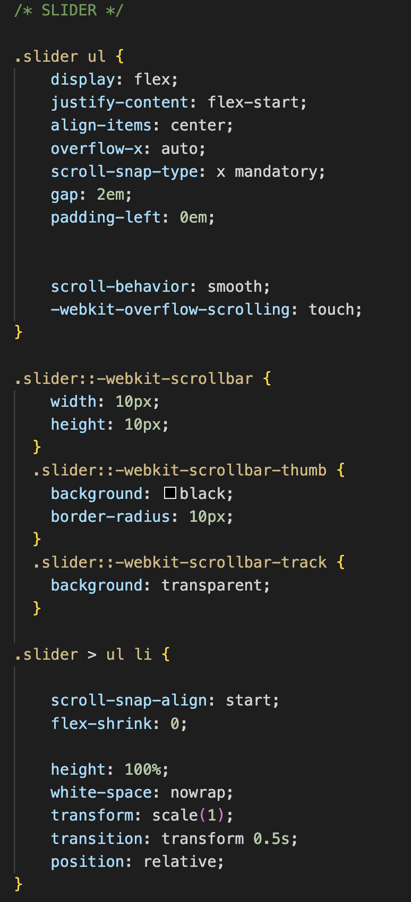

  Dit is de slider die ik heb gemaakt in de tweede pagina.  

  ### Agenda voor meeting
  samen met je groepje opstellen

  | student 1      | student 2          | student 3    | student 4        |
  | ---            | ---                | ---          | ---              |
  | dit bespreken  | en dit             | en ik dit    | en dan ik dat    |
  | en dat ook nog | dit als er tijd is | nog een punt | dit wil ik zeker |
  | ...            | ...                | ...          | ...              |

  ### Verslag van meeting
  hier na afloop snel de uitkomsten van de meeting vastleggen

  - punt 1 HTML beetje opgeschoont
  - punt 2 De mockup ziet er goed uit
  - punt 3 De slider is gelukt
  - punt 4 Grid gaat steeds beter

## Eindgesprek (week 5)

  
uitwerken voor eindgesprek

  Ik heb mijn Micro animatie gemaakt en de laatste responsive fouten gefixt. Ik heb alle alt tekst verbeterd, ik heb Header structuur verbeterd en de Alt tekst ook de juiste class gegeven dat hij wel zichtbaar is voor de screenreader maar niet voor het oog.

  ### Je uitkomst - karakteristiek screenshots:
  

  ### Dit ging goed/Heb ik geleerd: 
  Korte omschrijving met plaatjes

  Ik heb geleerd hoe ik tewerk kan gaan met CSS, hoe ik echt kan vormgeven met code. Maar ook hoe media queries werken, hoe ik dingen responsive maak. Ik heb geleerd hoe flexbox in elkaar zit maar ook hoe ik met grid kan werken. Ik heb in dit vak pas echt geleerd hoe coderen een beetje werkt. Ik vond het wel lastig maar ook een leuke uitdaging.

  
  
  Na dat ik deze mockup responsive gemaakt had snapte ik responsivenes het best

  ### Dit was lastig/Is niet gelukt:
  Korte omschrijving met plaatjes

  Ik vind het lastig om alles semantisch te doen, bijvoorbeeld de juiste alt teksten te gebruiken of de juiste header structuur te gebruiken. Ook als ik foutjes had waar k niet gelijk aan zag wat de oorzaak was vond ik het erg lastig om ze te verbeteren en dat koste erg veel tijd maar uiteindelijk is het wel gelukt.

  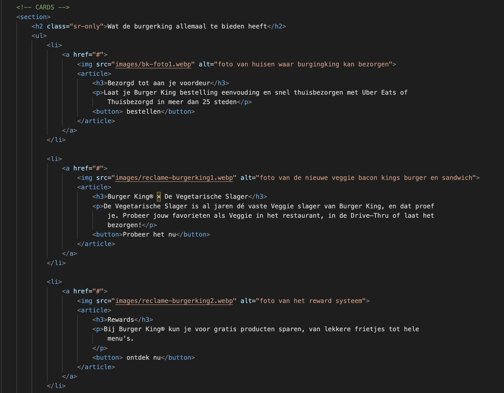
  Dit is mijn header structuur nadat ik hem verbeterd heb, hier voor waren het alleen maar h2 elementen.

## Bronnenlijst

  
continu bijhouden terwijl je werkt

  Nb. Wees specifiek ('css-tricks' als bron is bijv. niet specifiek genoeg). 
  Nb. ChatGpT en andere AI horen er ook bij.
  Nb. Vermeld de bronnen ook in je code.

  1. Studenten assistenten
  2. De docent
  4. Klasgenoten

